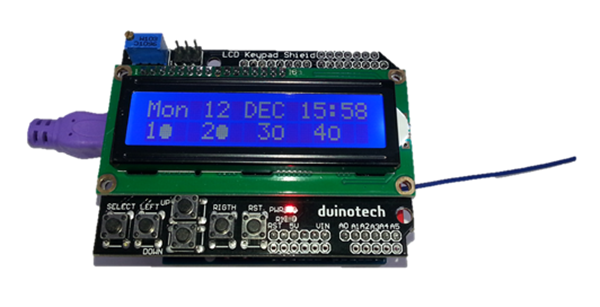
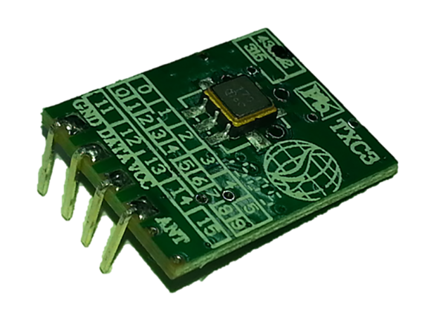
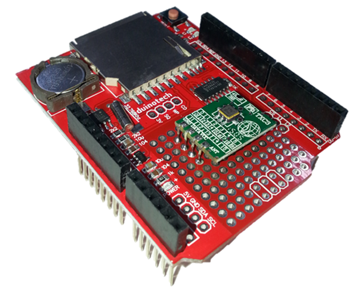
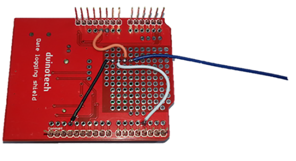
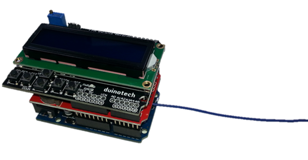
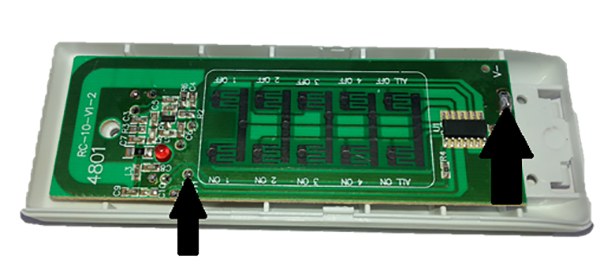
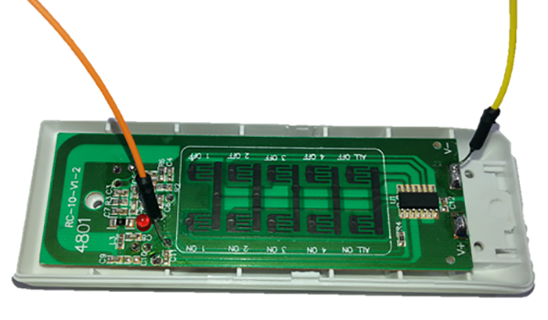

## RTC Power Point Timer

If you’ve been thinking about how you’d control a 240V appliance with an Arduino without worrying about getting zapped, then here is a solution. We’ve developed a project that interfaces to our MS6148 Remote Controlled Mains Outlet using a 433MHz transmitter. Building on the simplicity of the [Arduino Clock](https://jaycar.com.au/diy-arduino-clock-uno) ,  we’ve added the 433MHz transmitter and some extra code, which gives the following features:

* Switch appliances off or on with a minute of resolution
* Time is saved when power off
* Up to 99 timers can be programmed
* Can be set for any day of the week, or all days, weekdays or weekends
* Can be set to turn single channel or all channels on or off
* Manual control of transmitter for setup and troubleshooting

And being Arduino, there’s nothing to stop you taking the code apart and adding your own features.



## Shopping List:

|Qty| Code | Description |
|---|---|---|
|1 | [XC4410](http://jaycar.com.au/p/XC4410) | uno main board
|1 | [XC4536](http://jaycar.com.au/p/XC4536) | Datalogging shield
|1 | [XC4454](http://jaycar.com.au/p/XC4454) | LCD controller shield
|1 | [ZW3100](http://jaycar.com.au/p/ZW3100) | Wireless 433Mhz Transmitter module
|1 | [MS6148](http://jaycar.com.au/p/MS6148) | Remote Controlled Mains Outlet

You’ll also need about half a metre of insulated hookup wire- we used offcuts of [WC6028 Jumper Leads](https://jaycar.com.au/p/WC6028) to help with colour coding. If you already have the [Arduino Clock](https://jaycar.com.au/diy-arduino-clock-uno) , then you’ll only need the last two items.

## Construction:

There is a small amount of soldering to complete construction, and then it’s simply a case of plugging the shields together. Here are the connections that are soldered:

|Uno/Shield|ZW3100|Function
|---|---|---
|GND|GND|Ground
|5V|VCC|Power
|D3|DATA|Signal
||ANT|Antenna
Note that the Antenna connection doesn’t even go back to the Uno- ideally, it should be about 17cm long (quarter wave antenna at 433MHz signal frequency). Just be sure that the unconnected end doesn’t have free copper that might touch something and cause a short circuit.

The first step is to carefully bend the pins back on the ZW3100 433MHz Module- this will allow it to lie flat:



Then solder the module onto the prototyping area of the Data Logging Shield:



And then run wires on the other side to make the necessary connections:



For best results, leave the antenna wire hanging outside the assembly, as this will give the best signal strength and transmission. The other connections that are made between the shields and Uno are the same as the

[Arduino Clock](https://jaycar.com.au/diy-arduino-clock-uno)

|Duinotech|Data Log Shield|LCD Shield|Function
|---|---|---|---
|5V|5V|5V|Power
|GND|GND|GND|Ground
|A4(SDA)|A4(SDA)||I2C Data
|A5(SCL)|A5(SCL)||I2C Clock
|D10|D10||SD Card Select
|D11|D11||Master In Slave Out
|D12|D12||Master Out Slave In
|D13|D13||Serial Clock
|A0|A0||Pushbuttons
|D4||D4|Data Bit 4
|D5||D5|Data Bit 5
|D6||D6|Data Bit 6
|D7||D7|Data Bit 7
|D8||D8|Register Select
|D9||D9|Enable

Here’s the final assembly:



## Sketch:

Like many of projects, this one requires a number of libraries- four in fact, although three of them are included with the Arduino IDE. The RTCLib library can be installed via the Library Manager. Click Sketch>Include Library>Manage Libraries, and search for ‘rtclib’, then click ‘RTCLib’ and install.

The sketch is quite long, and is not included here (most of the source code is formatting the data for display on the LCD). Where possible, the sketch is broken down to provide smaller functional sections, and it has been based around the original Arduino Clock project, with sections added to detect timer events and extra settings menus.

You should be able to choose the Uno board and serial port, then upload the sketch without changes. The LCD will display a time and date after the sketch is loaded. If you get the message ‘RTC fail’ or gibberish on the LCD, check the RTC battery and that the shield is working by trying some of the example sketches from File>Examples>RTClib.

## Sketch:

There’s a bit of setup to be done after loading the sketch. The first will be to set the time- you can either use the `XC4536_Setting` sketch (load the sketch and let it run for a few seconds, then reload the `RTC_Power_Point_Timer` sketch) or press select, and use the up/down/left/right keys to change the time. Note that the day of the week changes to the year- this needs to be correct to ensure that days of the week and leap years are handled correctly. Press select again to exit setting mode.

From the main display, the left/up/down and right (corresponding to 1/2/3/4 or A/B/C/D on the remote) buttons can be used to send a signal to toggle the Outlet. You can see the last transmitted state in the bottom line. To pair an Outlet, unplug then replug the Outlet into the socket (or switch it on and off if it has a switch- we find this is easier), then press one of the buttons to pair. If the Outlet turns on, then it has worked- keep pressing the button to check that it turns it on and off. You can then pair the other buttons to other Outlets if you like.

Each Outlet can be controlled by multiple remotes (we set one up with three remotes controlling it), so you can use the included remote as well as the Timer. It’s possible to find out the code on the remote to make it easier to reprogram the Outlets, but this will involve opening up the remotes and soldering wires to them. See the Improvements section later.

To get into the second menu on the Timer, hold the select button, and press reset, and wait a few seconds before releasing the select button. The first screen allows all remote codes to be output, including the` All On` and` All Off` (to test if these are working with your Outlets). Press up or down to choose the command, then press right to issue that command. If you want to clear all the pairings in an Outlet, scroll to All Off, then turn power off and on to the Outlet, and press right to issue the All Off command.

The final menu is the timer setup, and can be accessed by pressing select on the second menu.

The settings are changed by scrolling up and down, and the items can be selected by pressing left and right. All settings are saved when select is pressed again- if you don’t want to save, press reset to cancel. If you find you need more timer slots, you can change the TIMERCOUNT define:
```c
#define TIMERCOUNT 10
```
To any number up to 99. More than 99 will work, but you won’t able to see which number you’re editing.

After this, your timer will be set up. The LCD will display a ‘T’ in the bottom right corner when it is transmitting a timer setting, so you can see when the Outlets should be responding.

If the Outlets are not working as you think they should, double check that they work with the included remote as well.

## Improvements:

Just like any Arduino project, this one can be customized to a high degree. There’s no reason you can’t have other sensors or inputs to control the Outlets- you could combine this project with the [Ethernet IO Controller](https://jaycar.com.au/diy-ethernet-controller) to be able to control your Outlets via a browser, or add a[XC4444 PIR Sensor Module](https://jaycar.com.au/p/XC4444) to have timer controlled sensor lights. You can of course get extra outlets by purchasing extra[MS6147](https://jaycar.com.au/p/MS6147) or[MS6149](https://jaycar.com.au/p/MS6149) kits. With the sketch as written, you can control up to four unique Outlets. With some modification to the code to allow multiple addresses, you could do many more.

In the repo, you will find a sketch called `Minimal_433MHz_Controller_for_MS6148` this contains the basics for controlling Outlets (this sketch toggles one Outlet off and on every three seconds).

To make this basic sketch work, make sure to include the `packet()`, `rfcrc()`, `reverse()` and `sendrf()` functions in your sketch, and set the `OUTPIN` define to the pin you are using. The following command is then used to send a command:

```c
sendrf(packet(address,rfcmds[0]));
```

where address is the coded address of the Outlet, and rfcmds[0] is the code Outlet 1 on.

Cloning addresses from the remotes is not easy, but is possible and means you need to open up the remote to attach wires directly to the board to detect the signals. It’s how we worked out how the signals worked for this project.

Open the case on the remote by unscrewing the three screws and gently pulling apart the front cover and key mat.



Then solder jumper wires to the two points above- battery negative, and the large solder pad next to C11 (if you follow this trace, it leads back to pin 2 on the IC). This is the raw signal out of the IC before it gets to the 433MHz transmitter.



Then install the batteries and place the key mat back over the pads so that the buttons can be operated. Connect the wire from V- (yellow wire above) to the GND pin of an Uno, and connect the signal wire (orange) to D8 of the same Uno, and upload the MS6148_Reader sketch, and open the Serial Monitor at 115200 Baud. Press the keys on the remote, and you should see codes on the screen of the Serial Monitor. The first five hex nybbles are the address, and the 6th nybble is the command (so is the same for the same buttons on different remotes). The other data is a checksum, and this is recreated by the `rfcrc()` function.

Once you have the code, you can unsolder the wires and reassemble the remote. The five hex nybbles can be put as the address in the RTC_Power_Point_Timer sketch. It’s not really necessary, but might make it easier to reprogram the Outlets if you need to do it often.

## Code:

There are four sketch files

* `XC4536_Setting`
* `RTC_Power_Point_Timer`
* `MS6148_Reader`
* `Minimal_433MHz_Controller_for_MS6148`

`RTC_Power_Point_Timer` is the main project sketch.
